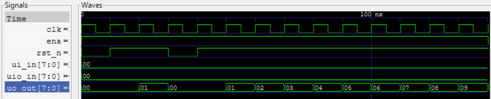
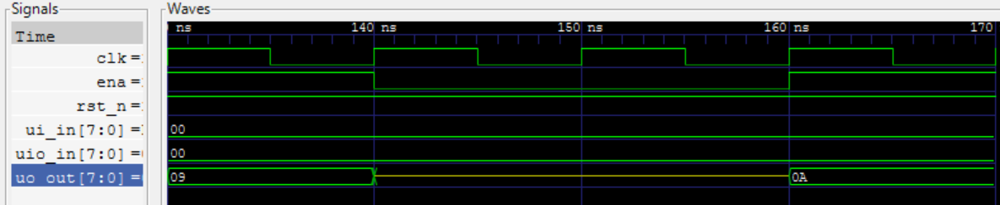
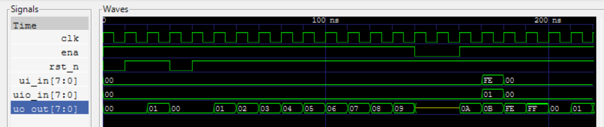
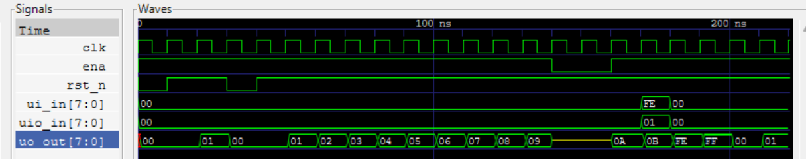

<!---

This file is used to generate your project datasheet. Please fill in the information below and delete any unused
sections.

You can also include images in this folder and reference them in the markdown. Each image must be less than
512 kb in size, and the combined size of all images must be less than 1 MB.
-->

## How it works

This is an 8-bit binary counter with asynchronous reset, synchronous load and tri-state outputs:

#### Inputs:
- Enable - ena
- Reset - rst_n
- Load Write - uio_in[0]
- Load Data - ui_in[7:0]

#### Outputs:
- Data - uo_out[7:0]

## How to test

Simply run the test.py function! I have pre-made 3 tests to make sure the chip gives the expected output for each function:

#### Test 1:  Reset and Increment
- This first increments then sends n_rst to insure counter resets
- Then increments timer 10 times and ensures increments each time

#### Test 2: TRI-STATE
- Holds the enable pin low and ensure data pins go into HIGH-Z mode

#### Test 3: Load and Wrap Around
- Loads 253 and ensures output is correct
- Increments till 255, and once incremented one more ensures output is 0
- Final test to make sure increments correctly after reset

#### Comparing Pre and Post Layout
Below you can see the full waveform of pre-layout using CocoTB:

Below you can see the full waveform of post-layout using GCD:

AS you can see there is very minimal changes between the two waveforms meaning my implementation of the 8-bit counter have passed all it's tests!

## External hardware

None, just RTL sim
